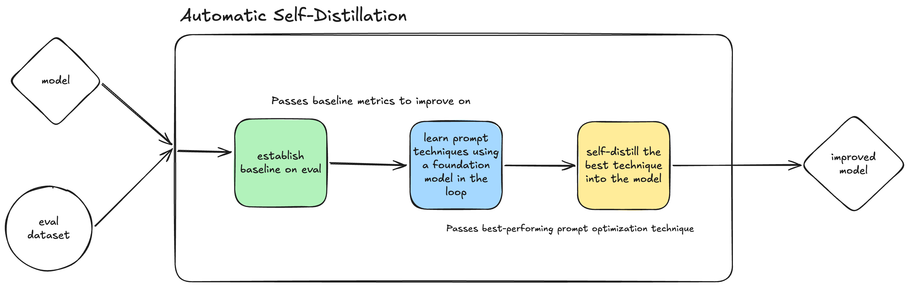

# Automatic Self-Distillation (ASD)

Luke Atkins & Gerardo Salazar

Based on ideas from:  https://arxiv.org/abs/2603.05433

## Core Idea

The ASD system improves the performance of a given model on a given eval dataset by
learning prompt techniques that improve the performance of the model, then self-distilling the best prompt technique
into the model so the final model performs better without even needing the specific prompting.




## Usage

Run from the repository root with `uv`:

```bash
uv run asd --help
uv run asd run --model <model> --eval <path-to-eval> --gpus <gpu-count>
```

`--model` must be a Hugging Face model identifier (for example, `Qwen/Qwen3-4B-Thinking-2507`).